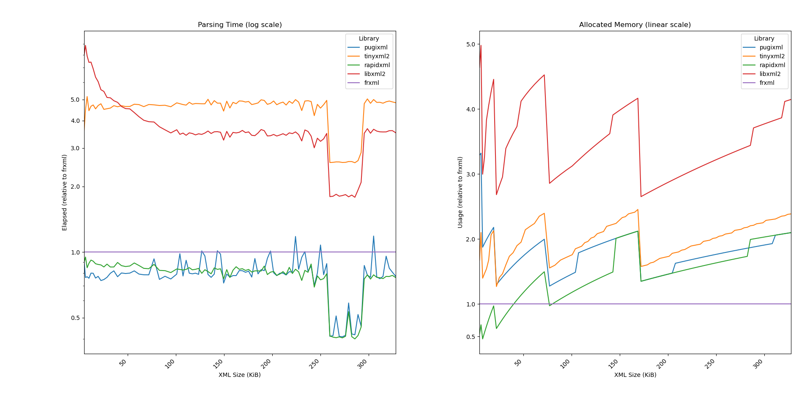

# FRXML : Fast/Robust XML parser

FRXML is DOM-based light-weight & robust XML parser, written in C++17 - with a goal
that is to archive `O(n)` level of memory occupancy,
regardless of how deep the depth of the xml document is

## Benchmark



* lower is better

## Features

- zero-copy/single-pass parsing
- UTF-8 supported (without BOM)
- limited XML 1.0

## Limitation

- No `<! ... >` things such as `<!DOCTYPE ...` or `<!ENTITY ...` etc...
- No entity(`&lt;`, `&#x20`) encoder/decoder (to achieve zero-copy)

Currently, FRXML doesn't support XML 1.0 specification yet.
Below is implemented XML format with EBNF format:

```ebnf
document ::= prolog misc* element misc*

prolog ::= pcinstr? /* XML declaration is subset of pcinstr */

name ::= NAME_STARTCHAR NAME_CHAR*

node ::= element | misc
misc ::= comment | pcinstr | S

      element ::= norm_element | empty_element
 norm_element ::= '<' name (S attr)* S? '>' content '</' name '>'
empty_element ::= '<' name (S attr)* S? '/>'
      comment ::= '<!--' '<!--' ((CHAR - '-') | ('-' (CHAR - '-')))* '-->'
      pcinstr ::= '<?' name (S (CHAR* - (CHAR* '?>' CHAR*)))? '?>'
      
content ::= node (S? content)?
```

## Usage

### Parsing

```c++
#include <iostream>
#include <frxml.h>

int main()
{
    std::string xml = R"(
<?xml version="1.0" encoding="UTF-8"?>
<?ユニコードは 好きですか??>
<!-- HELLO! -->
<xml0>
    <유니코드 attr="안녕하세요" attr0="1"><xml3 />
<!-- HELLO! -->
    </유니코드>
    <?ユニコードは 好きですか??>
    <xml2 attr="c"/>
</xml0>
<!-- HELLO! -->
)";
    frxml::doc doc{ xml };
    if (!doc)
    {
        std::cout << std::to_string(error.exception()) << '\n';
    }
}
```
